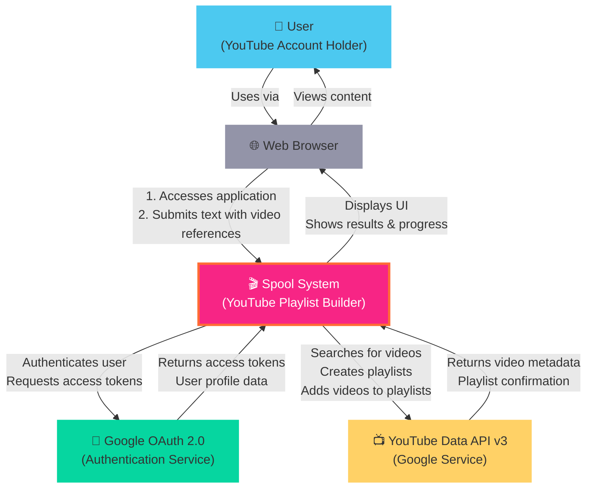
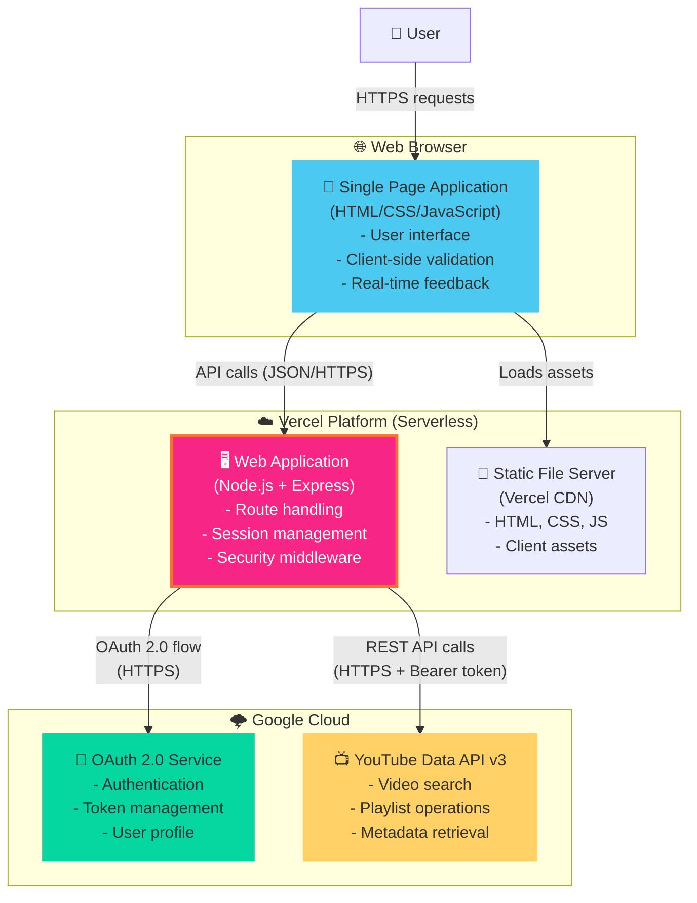
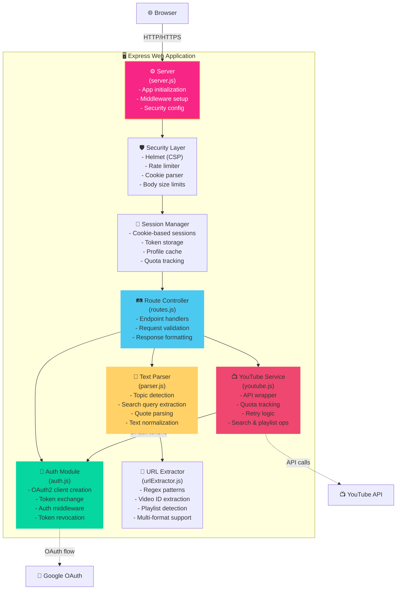
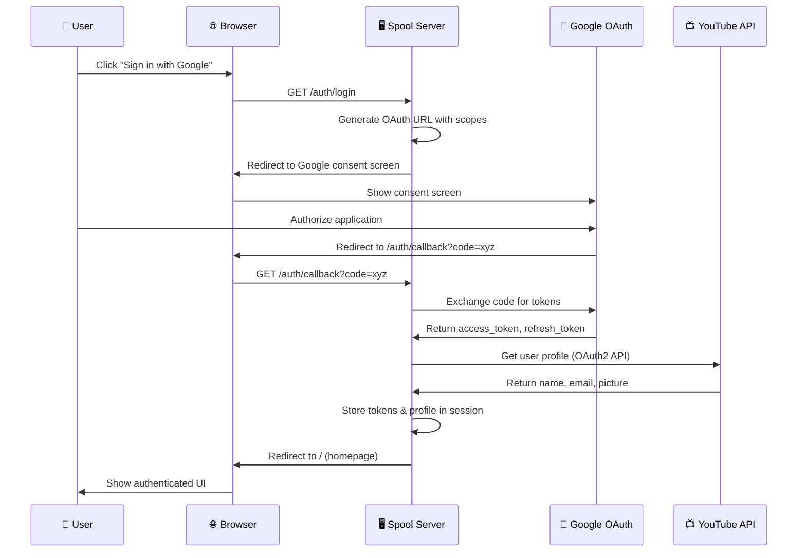
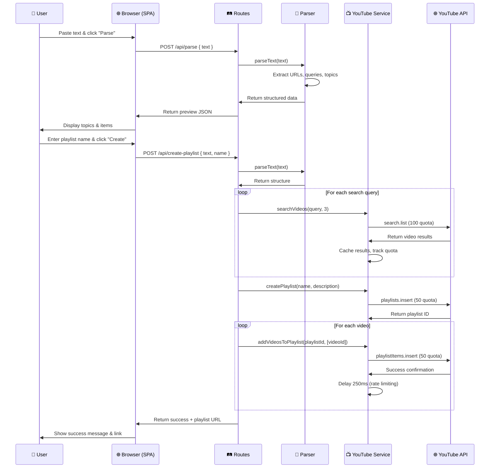
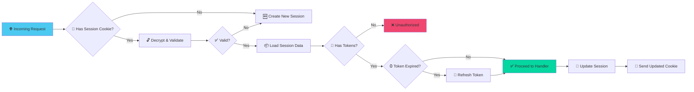
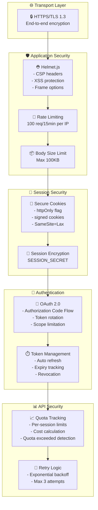
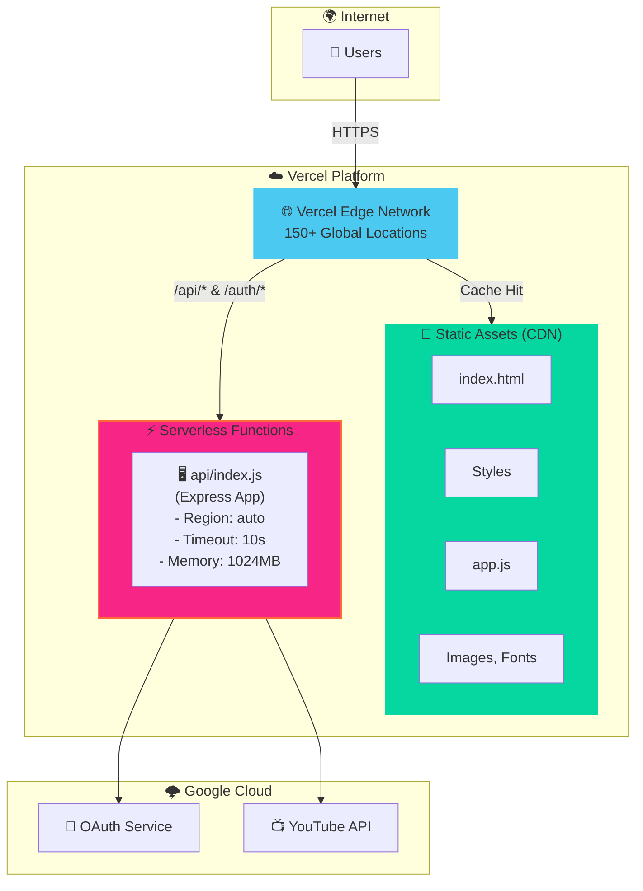

# 🏗️ C4 Architecture Documentation

> **Spool - YouTube Playlist Builder**  
> A comprehensive architectural overview using the C4 model

## 📋 Table of Contents

- [Introduction](#-introduction)
- [Level 1: System Context](#-level-1-system-context-diagram)
- [Level 2: Container](#-level-2-container-diagram)
- [Level 3: Component](#-level-3-component-diagram)
- [Data Flow](#-data-flow-diagrams)
- [Security Architecture](#-security-architecture)
- [Deployment Architecture](#-deployment-architecture)
- [Technology Decisions](#-technology-decisions)

---

## 🌐 Introduction

The C4 model provides a hierarchical way to visualize software architecture at different levels of abstraction. This document describes the **Spool** (YouTube Playlist Builder) architecture using the C4 model approach.

### What is C4?

- **Level 1 - Context**: System boundary and external dependencies
- **Level 2 - Container**: High-level technology choices (apps, services, databases)
- **Level 3 - Component**: Major logical components within containers
- **Level 4 - Code**: Class/object level (not covered here)

---

## 🌍 Level 1: System Context Diagram

The System Context diagram shows how Spool fits into the world around it.

### Diagram



### Actors & External Systems

| Entity | Type | Description |
|--------|------|-------------|
| 👤 **User** | Person | Content creator, educator, or learner who wants to organize YouTube videos into playlists |
| 🌐 **Web Browser** | External | User's web browser (Chrome, Firefox, Safari, Edge) |
| 🎬 **Spool** | System | The YouTube Playlist Builder application (this system) |
| 🔐 **Google OAuth 2.0** | External System | Google's authentication and authorization service |
| 📺 **YouTube Data API v3** | External System | Google's YouTube API for programmatic playlist and video management |

### Key Interactions

1. 🔑 **Authentication Flow**
   - User clicks "Sign in with Google"
   - Spool redirects to Google OAuth
   - User authorizes access to YouTube and profile
   - Spool receives access tokens

2. 📝 **Text Processing Flow**
   - User pastes unstructured text
   - Spool parses URLs and search queries
   - Spool organizes content by topics

3. 🎯 **Playlist Creation Flow**
   - Spool searches YouTube for queries
   - Validates video IDs
   - Creates playlist via API
   - Adds videos in order

---

## 📦 Level 2: Container Diagram

The Container diagram shows the high-level shape of the system architecture and technology choices.

### Diagram



### Container Details

#### 📱 Single Page Application (SPA)
- **Technology**: Vanilla JavaScript, HTML5, CSS3
- **Hosting**: Vercel CDN (static files)
- **Responsibilities**:
  - 🎨 Render modern dark UI with design system
  - ✅ Client-side input validation
  - 🔄 Handle user interactions
  - 📡 Make AJAX calls to backend
  - 📊 Display real-time progress updates
  - 🍪 Manage auth state

#### 🖥️ Web Application (Backend)
- **Technology**: Node.js v16+, Express.js v4
- **Hosting**: Vercel Serverless Functions
- **Responsibilities**:
  - 🛤️ Route HTTP requests
  - 🔐 Manage OAuth2 authentication flow
  - 🍪 Handle session state (cookie-based)
  - 🛡️ Apply security middleware (Helmet, rate limiting)
  - 📝 Parse and process text input
  - 🎬 Interact with YouTube API
  - 📊 Track API quota usage
  - ⚡ Implement retry logic with exponential backoff

#### 🔐 Google OAuth 2.0 Service
- **Provider**: Google Identity Platform
- **Protocol**: OAuth 2.0 (Authorization Code Flow)
- **Scopes**:
  - `youtube` - Full YouTube account access
  - `userinfo.profile` - User's name and picture
  - `userinfo.email` - User's email address

#### 📺 YouTube Data API v3
- **Provider**: Google Cloud
- **Protocol**: REST over HTTPS
- **Authentication**: OAuth 2.0 Bearer tokens
- **Key Operations**:
  - `search.list` - Search for videos (100 quota units)
  - `videos.list` - Get video details (1 quota unit)
  - `playlists.insert` - Create playlist (50 quota units)
  - `playlistItems.insert` - Add video to playlist (50 quota units)
  - `playlists.list` - List user playlists (1 quota unit)

---

## 🧩 Level 3: Component Diagram

The Component diagram shows the internal structure of the Web Application container.

### Backend Components



### Component Responsibilities

#### ⚙️ Server Component (`server.js`)
**Purpose**: Application bootstrap and configuration

**Responsibilities**:
- ✅ Load environment variables via dotenv
- 🛡️ Configure Helmet with strict CSP
- 🚦 Apply rate limiting (100 req/15min per IP)
- 🍪 Set up cookie-based sessions (serverless-compatible)
- 📦 Parse request bodies (100KB limit)
- 🌐 Serve static files from `/public`
- 🔧 Trust proxy for Vercel deployment

**Key Dependencies**: `express`, `helmet`, `express-rate-limit`, `cookie-session`

#### 🛤️ Route Controller (`routes.js`)
**Purpose**: HTTP endpoint handlers

**Endpoints Implemented**:
- `GET /auth/login` - Initiate OAuth flow
- `GET /auth/callback` - Handle OAuth callback
- `GET /auth/status` - Check auth state
- `POST /auth/logout` - Revoke tokens
- `GET /api/profile` - Get user data & playlists
- `POST /api/profile/avatar` - Update avatar
- `POST /api/parse` - Parse text (preview)
- `POST /api/create-playlist` - Create YouTube playlist

**Features**:
- ✅ Input validation
- 🔐 Auth middleware enforcement
- 📊 Error handling
- 📝 Response formatting

#### 🔐 Auth Module (`auth.js`)
**Purpose**: Google OAuth 2.0 integration

**Functions**:
- `createOAuth2Client()` - Initialize OAuth client
- `getAuthUrl()` - Generate consent screen URL
- `getTokens()` - Exchange code for access/refresh tokens
- `requireAuth()` - Middleware to protect routes
- `revokeToken()` - Invalidate access tokens

**Token Management**:
- 🔄 Auto-refresh using googleapis client
- 🍪 Store in encrypted session cookies
- 📊 Listen for token refresh events
- ⏰ Track expiry timestamps

**Scopes Requested**:
- `youtube` - Read/write YouTube data
- `userinfo.profile` - User name & picture
- `userinfo.email` - User email

#### 📝 Text Parser (`parser.js`)
**Purpose**: Extract structured data from unstructured text

**Capabilities**:

1. **Topic Detection** 🏷️
   - Markdown headers (`##`, `###`)
   - Numbered lists (`1.`, `2.`)
   - Topic labels (`Topic 1:`, `Module 2 —`)
   - Bold markers (`**Title**`)

2. **Search Query Extraction** 🔍
   - Quoted strings (`"query here"`)
   - Search directives (`search: topic`)
   - Curly quote normalization
   - Minimum 5 characters

3. **URL Extraction** 🔗
   - Delegates to URLExtractor
   - Deduplicates URLs

4. **Channel Detection** 📺
   - `@handle` mentions
   - Natural language (`on XYZ channel`)

**Output Format**:
```javascript
{
  topics: [
    {
      title: "Topic Name",
      items: [
        { type: 'video', id: 'abc123' },
        { type: 'search', query: 'search term' }
      ]
    }
  ]
}
```

#### 🔗 URL Extractor (`urlExtractor.js`)
**Purpose**: Extract YouTube URLs using regex patterns

**Supported Formats**:
- 🎥 Standard: `youtube.com/watch?v=ID`
- ⚡ Short: `youtu.be/ID`
- 📱 Shorts: `youtube.com/shorts/ID`
- 🖼️ Embed: `youtube.com/embed/ID`
- 📋 Playlists: `youtube.com/playlist?list=ID`
- 📺 Channels: `youtube.com/channel/ID`, `youtube.com/@handle`

**Features**:
- ✅ Deduplication
- ✅ Video ID validation (11 characters, alphanumeric + `-_`)
- ✅ Global flag for multiple matches

#### 📺 YouTube Service (`youtube.js`)
**Purpose**: YouTube Data API v3 wrapper with quota tracking

**Core Functions**:

1. **`searchVideos(query, maxResults)`** 🔍
   - Searches YouTube for videos
   - Returns top N results (default: 3)
   - Caches results in session
   - Cost: 100 quota units

2. **`getVideoDetails(videoIds)`** 📊
   - Fetches metadata for video IDs
   - Validates video existence
   - Returns title, description, thumbnails
   - Cost: 1 quota unit per request

3. **`createPlaylist(title, description, privacy)`** 📝
   - Creates a new YouTube playlist
   - Returns playlist ID
   - Cost: 50 quota units

4. **`addVideosToPlaylist(playlistId, videoIds)`** ➕
   - Adds videos to playlist sequentially
   - Rate limited (250ms between requests)
   - Cost: 50 quota units per video

5. **`listUserPlaylists(maxResults)`** 📋
   - Fetches user's existing playlists
   - Cost: 1 quota unit

**Advanced Features**:
- ⚡ Exponential backoff retry (up to 3 attempts)
- 🎯 Rate limiting (250ms delay between requests)
- 📊 Quota tracking per session
- 💾 Search result caching
- ❌ Quota exceeded detection
- 🔄 Auto token refresh handling

**Error Handling**:
- 401 Unauthorized → Retry after token refresh
- 403 Forbidden → Check for quota exceeded
- 429 Too Many Requests → Exponential backoff

---

## 🌊 Data Flow Diagrams

### Authentication Flow



### Playlist Creation Flow



### Session Management Flow



---

## 🛡️ Security Architecture

### Security Layers



### Content Security Policy

```http
Content-Security-Policy:
  default-src 'self';
  script-src 'self';
  style-src 'self' 'unsafe-inline' https://fonts.googleapis.com;
  img-src 'self' https://i.ytimg.com https://*.ytimg.com https://lh3.googleusercontent.com data:;
  connect-src 'self';
  font-src 'self' https://fonts.gstatic.com;
  object-src 'none';
  frame-ancestors 'none';
```

**Rationale**:
- ✅ Only load scripts from own domain (no XSS via CDN)
- ✅ Inline styles allowed for critical CSS (performance)
- ✅ Images from YouTube thumbnails & Google profile pics
- ✅ Fonts from Google Fonts CDN
- ❌ No plugins (Flash, Java)
- ❌ Cannot be embedded in iframes (clickjacking protection)

### Authentication Security

- 🔐 **Authorization Code Flow** (not Implicit Flow)
- ⏳ **Short-lived access tokens** (1 hour typical)
- 🔄 **Refresh tokens** for long sessions
- 📊 **Minimal token storage** (only essential fields in cookie)
- 🚫 **Token revocation** on logout
- 🔑 **OAuth scopes** limited to necessary permissions

### Session Security

- 🍪 **Cookie-based sessions** (no server-side Redis needed for serverless)
- 🔐 **Encrypted cookies** using `SESSION_SECRET`
- 🛡️ **httpOnly flag** (prevents JavaScript access)
- 🌐 **secure flag** in production (HTTPS only)
- 🔒 **SameSite=Lax** (CSRF protection)
- ⏰ **Auto expiration** after inactivity

---

## ☁️ Deployment Architecture

### Vercel Serverless Architecture



### Deployment Configuration (`vercel.json`)

```json
{
  "version": 2,
  "builds": [
    {
      "src": "api/index.js",        // Express app entry point
      "use": "@vercel/node"          // Node.js builder
    },
    {
      "src": "public/**",            // Static files
      "use": "@vercel/static"        // Static builder
    }
  ],
  "routes": [
    { "src": "/auth/(.*)", "dest": "api/index.js" },       // Auth routes → serverless
    { "src": "/api/(.*)", "dest": "api/index.js" },        // API routes → serverless
    { "src": "/(.*\\.(js|css|ico|png|jpg|svg|woff2?))", "dest": "public/$1" },  // Assets → CDN
    { "src": "/(.*)", "dest": "public/index.html" }        // SPA fallback
  ]
}
```

### Environment Variables (Production)

Must be configured in Vercel dashboard:

| Variable | Purpose | Example |
|----------|---------|---------|
| `GOOGLE_CLIENT_ID` | OAuth client identifier | `123-xyz.apps.googleusercontent.com` |
| `GOOGLE_CLIENT_SECRET` | OAuth client secret | `GOCSPX-xxxx` |
| `GOOGLE_REDIRECT_URI` | OAuth callback URL | `https://spool.vercel.app/auth/callback` |
| `SESSION_SECRET` | Cookie encryption key | `(32-char hex string)` |
| `NODE_ENV` | Environment mode | `production` |
| `SEARCH_RESULTS_PER_QUERY` | Search limit | `3` |

### Scaling Characteristics

- ⚡ **Auto-scaling**: Serverless functions scale automatically (0-1000+ instances)
- 🌍 **Global CDN**: Static assets served from nearest edge location
- 💰 **Cost**: Pay-per-invocation (free tier: 100GB-hours/month)
- ⏱️ **Cold start**: ~200-500ms for Node.js functions
- 🔄 **Session state**: Cookie-based (no shared Redis needed)

### Limitations & Considerations

- ⏰ **Timeout**: 10 seconds max execution time (Hobby plan)
- 💾 **Memory**: 1024MB per function
- 📦 **Payload**: 5MB max request/response size
- 🍪 **Cookie size**: Keep sessions small (tokens only, ~2KB)
- 🌐 **Stateless**: No persistent connections (use polling for real-time updates)

---

## 🧠 Technology Decisions

### Why Node.js + Express?

✅ **Pros**:
- 🚀 Fast startup time (good for serverless)
- 📦 Rich ecosystem (googleapis, helmet, etc.)
- 🔄 Async I/O perfect for API calls
- 🌐 JavaScript everywhere (frontend + backend)

❌ **Cons**:
- Single-threaded (not CPU-intensive anyway)
- Callback complexity (mitigated with async/await)

### Why Vanilla JavaScript (no framework)?

✅ **Pros**:
- ⚡ Zero bundle size overhead
- 🎯 No learning curve for contributors
- 🔧 Full control over DOM
- 📦 No build step required

❌ **Cons**:
- More verbose than React/Vue
- Manual state management

**Decision**: For this simple SPA, a framework is overkill.

### Why Cookie-based Sessions (not JWT)?

✅ **Pros**:
- 🛡️ Automatically httpOnly (XSS protection)
- 🔐 Server-side encryption
- 🚫 Revocable on logout
- ☁️ Serverless-compatible (no Redis)

❌ **Cons**:
- 📦 Cookie size limit (~4KB)
- 🌐 Not suitable for cross-domain APIs

**Decision**: Sessions work best for same-origin web apps.

### Why Vercel (not AWS/GCP)?

✅ **Pros**:
- 🚀 Zero-config deployments
- 🌍 Global CDN included
- 🆓 Generous free tier
- 🔧 Excellent DX (Git integration)
- ⚡ Fast cold starts

❌ **Cons**:
- ⏰ 10s timeout limit
- 🔒 Vendor lock-in

**Decision**: Perfect for small-medium projects with bursty traffic.

### Why YouTube Data API v3?

✅ **Pros**:
- 📺 Official Google API
- 🔐 OAuth 2.0 integration
- 📊 Comprehensive features

❌ **Cons**:
- 💰 Quota limits (10,000 units/day)
- 💸 Expensive operations (search = 100 units)

**Mitigation**:
- 💾 Cache search results
- 🎯 Limit results per query
- 📊 Track quota in UI

---

## 📊 System Characteristics

### Performance

- ⚡ **Page Load**: < 2s (static files from CDN)
- 🔍 **Search API**: ~500-1000ms per query
- 📝 **Playlist Creation**: ~100ms + (N videos × 50 units × 250ms)
- 🌐 **Geographic Latency**: 20-200ms (Vercel edge network)

### Scalability

- 👥 **Concurrent Users**: ~100-1000 (limited by YouTube API quota, not server)
- 📊 **Daily Active Users**: ~500-1000 (with default quota)
- 🎬 **Playlists per day**: ~50-100 (quota-dependent)
- ⚡ **Auto-scaling**: Serverless functions scale to demand

### Reliability

- ✅ **Uptime**: 99.9% (Vercel SLA)
- 🔄 **Retry Logic**: 3 attempts with exponential backoff
- ❌ **Error Handling**: Graceful degradation
- 📊 **Quota Monitoring**: Real-time tracking

### Security

- 🔒 **Data Encryption**: TLS 1.3 in transit, encrypted cookies at rest
- 🔑 **Authentication**: OAuth 2.0 (industry standard)
- 🛡️ **OWASP Top 10**: Protected against XSS, CSRF, injection, etc.
- 🚦 **Rate Limiting**: 100 req/15min per IP

---

## 🎯 Future Enhancements

### Potential Architecture Changes

1. 💾 **Add Redis for Session Store**
   - Better scalability for high traffic
   - Share sessions across regions
   - Requires Redis hosting (Upstash, ElastiCache)

2. 📊 **Add Database (PostgreSQL/MongoDB)**
   - Store playlist history
   - Analytics dashboard
   - User preferences

3. 🔄 **WebSocket Support**
   - Real-time progress updates
   - No polling needed
   - Requires WebSocket-compatible host

4. 🌐 **API-first Architecture**
   - Separate frontend deployment
   - Mobile app support
   - Third-party integrations

5. 📦 **Microservices Split**
   - Auth service
   - Parser service
   - YouTube orchestrator service
   - Better separation of concerns

---

## 📚 References

- 📖 [C4 Model Documentation](https://c4model.com/)
- 🌐 [Vercel Documentation](https://vercel.com/docs)
- 📺 [YouTube Data API v3](https://developers.google.com/youtube/v3)
- 🔐 [Google OAuth 2.0](https://developers.google.com/identity/protocols/oauth2)
- 🛡️ [OWASP Top 10](https://owasp.org/www-project-top-ten/)
- ⚡ [Express.js Best Practices](https://expressjs.com/en/advanced/best-practice-security.html)

---

**Document Version**: 1.0  
**Last Updated**: March 2026  
**Maintained by**: Development Team

🎉 **Happy Building!**
